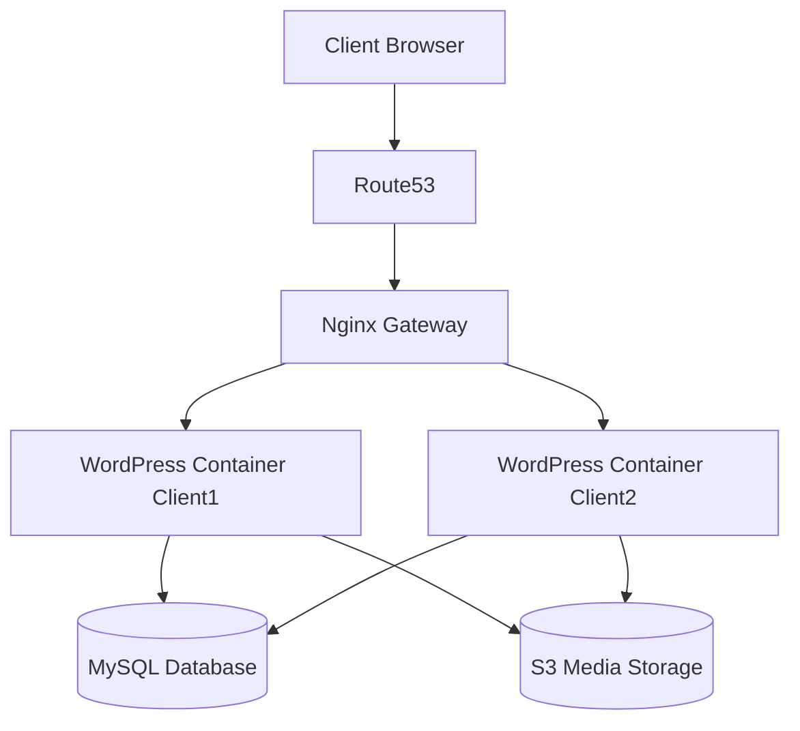

<div align="center">

# Multi-Client WordPress Hosting Platform

### Production-grade multi-tenant WordPress hosting on AWS
### The same architecture used by WP Engine, Kinsta, and Cloudways — built from scratch

[](https://aws.amazon.com/ecs/)
[](https://terraform.io)
[](https://github.com/features/actions)
[](LICENSE)

**Live platform:** `client1.babu-lahade.online` · `client2.babu-lahade.online` · `client3.babu-lahade.online`

</div>

---

## The Problem This Solves

Traditional shared hosting (cPanel, Hostinger) puts all clients on one server.  
**If Client A gets a traffic spike → Client B's site slows down.**  
**If Client A's database corrupts → Client B is at risk.**

This platform solves the multi-tenancy isolation problem:  
**Client A's spike, crash, or security issue cannot affect any other client — guaranteed and validated.**

---

## Architecture

```
Internet
    │
    ▼
Route53 (DNS — A record per client domain)
    │
    ▼
CloudFront (SSL termination · Static asset cache · ACM wildcard cert)
    │
    ▼
Application Load Balancer (Host-based routing)
    │
    ├── Host: client1.babu-lahade.online ──► Target Group 1
    ├── Host: client2.babu-lahade.online ──► Target Group 2
    ├── Host: client3.babu-lahade.online ──► Target Group 3
    ├── Host: client4.babu-lahade.online ──► Target Group 4
    └── Host: client5.babu-lahade.online ──► Target Group 5
                                                    │
                              ┌─────────────────────┘
                              ▼
                    ECS Fargate Task (per client · private subnet)
                    ┌─────────────────────────────────┐
                    │                                 │
                    │  ┌─────────────┐                │
                    │  │nginx:alpine │ ← port 80      │
                    │  │ /health→200 │                │
                    │  │fastcgi_pass │                │
                    │  └──────┬──────┘                │
                    │         │ FastCGI               │
                    │         ▼ localhost:9000         │
                    │  ┌─────────────┐                │
                    │  │wordpress:fpm│                │
                    │  │  port 9000  │                │
                    │  └──────┬──────┘                │
                    │         │                       │
                    └─────────┼───────────────────────┘
                              │
              ┌───────────────┼────────────────┐
              ▼               ▼                ▼
         RDS MySQL          EFS            Secrets
         (wp_clientN)  (wp-content)       Manager
         private subnet  per-client AP   (DB password)
```

**VPC Layout:**
```
10.0.0.0/16
├── Public Subnets    (10.0.1.0/24, 10.0.2.0/24)   — ALB + NAT Gateway
├── Private Subnets   (10.0.10.0/24, 10.0.11.0/24) — ECS Tasks
└── DB Subnets        (10.0.20.0/24, 10.0.21.0/24) — RDS MySQL
```

---

## Client Isolation — 4 Layers

| Layer | Isolation Method | Result |
|---|---|---|
| **Compute** | Separate ECS Fargate task per client | Client A crash cannot affect Client B |
| **Database** | Separate MySQL database per client (`wp_clientN`) | No cross-client data access possible |
| **Storage** | EFS access point per client (`/clientN/wp-content`) | Uploads and plugins fully isolated |
| **Logs** | Separate CloudWatch log group per client | Per-client debugging, no log mixing |

---

## Tech Stack

| Category | Technology | Why |
|---|---|---|
| **Compute** | ECS Fargate | Serverless containers — no EC2 management, native ALB + IAM integration |
| **Container** | wordpress:fpm + nginx:alpine | fpm on port 9000 (FastCGI) — no port conflict in awsvpc network mode |
| **IaC** | Terraform modules + `for_each` | New client = one variable change + `terraform apply` |
| **Load Balancer** | ALB host-based routing | One ALB, unlimited client domains via Host header rules |
| **Database** | RDS MySQL Multi-AZ | Managed, automatic failover, per-client database |
| **Storage** | EFS + per-client access points | wp-content persists across ECS task restarts |
| **Secrets** | AWS Secrets Manager | DB password injected at runtime — never hardcoded |
| **CI/CD** | GitHub Actions | Canary deploy → HTTP verify → global rollout |
| **Security** | OIDC federation | No static AWS keys — GitHub role assumed via token |
| **Scanning** | Trivy | CRITICAL CVEs block deployment before any push to ECR |
| **Monitoring** | CloudWatch Container Insights | Per-client CPU, memory, task count, request rate |
| **Alerting** | CloudWatch Alarms + SNS | Symptom-based alerts (5xx rate, task stopped, RDS connections) |
| **Dashboards** | Grafana | Per-client panels with deployment annotations |
| **DNS** | Route53 | A record per client domain → CloudFront |
| **CDN** | CloudFront + ACM | SSL termination, static asset caching, wildcard cert |

---

## CI/CD Pipeline — Canary Deployment Strategy

```
Push to main
      │
      ▼
┌─────────────────────────────────┐
│  BUILD + SCAN                   │
│  • docker build                 │
│  • Trivy scan (CRITICAL = fail) │
│  • Push to ECR (tagged: SHA)    │
└─────────────┬───────────────────┘
              │
              ▼
┌─────────────────────────────────┐
│  CANARY DEPLOY                  │
│  • Deploy to client3 only       │
│  • aws ecs wait services-stable │
│  • curl → check HTTP status     │
│    200? → continue              │
│    ≠200? → exit 1, HALT         │
└─────────────┬───────────────────┘
              │ HTTP 200 confirmed
              ▼
┌─────────────────────────────────┐
│  GLOBAL ROLLOUT                 │
│  • Deploy client4, client5      │
│  • Other clients protected      │
└─────────────────────────────────┘
```

**Key design decisions:**
- Images tagged with `$GITHUB_SHA` — every running task maps to an exact git commit
- OIDC federation — no static AWS access keys exist anywhere
- `aws ecs wait services-stable` — blocks until new task passes ALB health checks
- HTTP verification on live domain — not just "ECS says stable" but real end-to-end check
- `exit 1` on failure — GitHub Actions stops pipeline, client4/client5 untouched
- ECS circuit breaker with `rollback = true` — auto-reverts to previous task definition on failure

---

## Monitoring and Observability

### Alerting — Symptoms, Not Causes

| Alert | Threshold | Tier |
|---|---|---|
| ALB 5xx error rate | > 1% for 5 min | 🔴 Page immediately |
| ECS task count = 0 | Any service | 🔴 Page immediately |
| ECS CPU | > 75% sustained | 🟡 Warning |
| RDS connections | > 70% of max | 🟡 Warning |
| EFS burst credit | < 20% remaining | 🟡 Warning |

### Per-Client Grafana Dashboard

Each client has its own dashboard row:
- Request rate (req/sec)
- Error rate (%)
- P95 response time (ms)  
- ECS task count (shows auto-scaling events)
- RDS active connections

Deployment events shown as annotations — every spike correlates to a deploy.

### Structured Nginx Logs

```json
{
  "time": "2026-04-10T14:32:01Z",
  "client_id": "client1",
  "method": "GET",
  "uri": "/wp-admin/",
  "status": 200,
  "response_time": 0.243,
  "upstream_time": "0.241"
}
```

Query per-client errors in CloudWatch Logs Insights:
```sql
fields @timestamp, uri, status, response_time
| filter client_id = "client1" and status >= 500
| sort response_time desc
| limit 20
```

---

## Infrastructure as Code — Terraform Module Design

```
infrastructure/terraform/
├── main.tf                    # Root — calls all modules
├── variables.tf
├── outputs.tf
├── terraform.tfvars           # Client list — gitignored
└── modules/
    ├── vpc/                   # VPC, subnets, IGW, NAT, route tables
    ├── security_groups/       # ALB SG, App SG, RDS SG, EFS SG
    ├── alb/                   # ALB, target groups, listener rules per client
    ├── rds/                   # RDS MySQL, subnet group, parameter group
    ├── ecs/                   # Cluster, task definitions, services, autoscaling
    ├── efs/                   # EFS filesystem, mount targets, access points
    ├── secrets/               # Secrets Manager, rotation config
    ├── cloudfront/            # Distribution, cache behaviors, ACM cert
    ├── route53/               # A records per client
    └── monitoring/            # CloudWatch alarms, SNS, Grafana
```

**Adding a new client — one change:**
```hcl
# terraform.tfvars
ecs_clients = ["client1", "client2", "client3", "client4", "client5", "client6"]
#                                                                        ^^^^^^^^
#                                                                        add this
```

`terraform apply` creates: ECS task definition, ECS service, target group, ALB listener rule,
CloudWatch log groups, EFS access point, Grafana dashboard row. Automatically.

---

## Real Problems Debugged During Build

These are real failures hit during development — not from tutorials:

**1. ECS containers in restart loop**
Both `wordpress:latest` and `nginx` tried to use port 80 in `awsvpc` network mode (shared network namespace). Port conflict caused immediate container crash.
**Fix:** Switched to `wordpress:fpm` (PHP-FPM on port 9000, FastCGI protocol). nginx connects via `fastcgi_pass 127.0.0.1:9000` — not `proxy_pass` which is HTTP only.

**2. ALB health check loop causing task kills**
ALB health check hitting `/` during WordPress DB initialization returned 400. ALB marked target unhealthy → ECS killed task → restart → same cycle.
**Fix:** nginx `/health` endpoint returns 200 independently of WordPress state. ALB health check path changed to `/health`. Grace period set to 120s.

**3. WordPress "Error establishing database connection"**
`WORDPRESS_DB_HOST` was set to `aws_db_instance.wordpress.endpoint` which outputs `hostname:3306`. WordPress adds port internally — double port caused connection failure.
**Fix:** Changed to `aws_db_instance.wordpress.address` (hostname only). Critical distinction documented in Terraform module.

**4. nginx 502 on PHP requests**
nginx `proxy_pass` used for PHP routing. `wordpress:fpm` speaks FastCGI protocol, not HTTP. `proxy_pass` expects HTTP — protocol mismatch causes 502.
**Fix:** Changed to `fastcgi_pass` with `include fastcgi_params` and `SCRIPT_FILENAME` parameter.

**5. EFS mount causing task startup failure**
EFS mount target didn't exist in the same AZ as the ECS task subnet. NFS connection timed out at task start.
**Fix:** Created EFS mount target in every private subnet. Added `depends_on = [aws_efs_mount_target.wordpress]` to task definition.

---

## Auto-Scaling — Per-Client Isolation Proof

Each client scales independently. Client1 spike does not trigger Client2 scaling.

```
Scaling policies per client:
• CPU > 60% sustained    → scale out
• ALB requests > 1000/task → scale out  
• Min: 1 task · Max: 4 tasks
• Scale-out cooldown: 60s
• Scale-in cooldown: 300s
```

---

## Project Phases

| Phase | What Was Built | Status |
|---|---|---|
| **P0** | VPC, networking, Terraform remote state, security groups | ✅ Complete |
| **P1** | EC2 + docker-compose (learning phase — understand the stack) | ✅ Complete |
| **P2** | EKS — managed Kubernetes, ingress controller, HPA | ✅ Complete |
| **P3** | ECS Fargate — final production compute, EFS, Secrets Manager | ✅ Complete |
| **P4** | RDS Multi-AZ, S3 media offload, ElastiCache Redis | ✅ Complete |
| **P5** | HTTPS, CloudFront CDN, Route53, ACM wildcard cert | ✅ Complete |
| **P6** | GitHub Actions CI/CD — Trivy scan, ECR, canary deployment | ✅ Complete |
| **P7** | CloudWatch monitoring, Grafana dashboards, SNS alerting | ✅ Complete |
| **P8** | k6 load testing — isolation proof, auto-scaling proof | 🔨 In Progress |

---

## Security Practices

- **No static AWS keys** — GitHub Actions uses OIDC role federation, scoped to this repo + main branch only
- **No hardcoded secrets** — DB password stored in Secrets Manager, injected at ECS task start
- **Image scanning** — Trivy blocks deployment on any CRITICAL CVE before ECR push
- **Network isolation** — ECS tasks in private subnets, RDS in isolated DB subnets, no public IPs
- **Security group chaining** — RDS accepts port 3306 from ECS SG ID only (not VPC CIDR)
- **EFS encryption** — transit encryption enabled on all EFS mounts
- **ALB HTTPS** — HTTP redirects to HTTPS, ACM cert on both ALB and CloudFront

---

## Folder Structure

```
.
├── .github/workflows/         # CI/CD pipeline (build, scan, canary deploy)
├── docker/                    # Dockerfile, nginx config
├── infrastructure/terraform/  # All IaC — modules per AWS service
├── docs/
│   ├── architecture.md        # Detailed architecture decisions
│   ├── failures.md            # Real debugging log
│   ├── runbook.md             # Operational runbook
│   └── scaling.md             # Auto-scaling design
├── docker-compose.yml         # Local development only
└── README.md
```

---

## Author

**Babu Lahade**  
MCA — Cloud Computing · Savitribai Phule Pune University · 2026  
[LinkedIn](https://linkedin.com/in/babu-lahade-656034223) · [GitHub](https://github.com/BabuLahade)

> *Built to understand how production multi-tenant hosting actually works —  
> not by following a tutorial, but by hitting real failures and fixing them.*


# Multi-Client WordPress Hosting Platform

A DevOps platform that automatically provisions and manages multiple isolated WordPress websites for different clients using AWS infrastructure and containerized services.

The system demonstrates real-world platform engineering concepts:

- multi-tenant hosting
- automated provisioning
- infrastructure as code
- reverse proxy routing
- monitoring and failure handling

---

## Architecture Overview



Detailed architecture explanation is available in:

docs/architecture.md

---

## Key Features

- automatic provisioning of WordPress sites
- domain routing using Nginx reverse proxy
- container isolation between clients
- infrastructure managed using Terraform
- monitoring with Prometheus and Grafana
- failure analysis documentation

---

## Technology Stack

- AWS EC2
- Docker
- Nginx
- Terraform
- MySQL
- Prometheus
- Grafana

Technology decisions explained in:

docs/tech-decisions.md

---

## Project Structure

```bash
wordpress-platform/
│
├── infrastructure
├── provisioning-service
├── nginx-gateway
├── wordpress-template
├── monitoring
└── docs
```

---

## Request Flow

1. user visits a client domain
2. DNS resolves domain using Route53
3. request reaches Nginx gateway
4. Nginx routes request to correct WordPress container
5. WordPress retrieves data from database
6. response returned to user

---

## Running the Platform Locally

Clone the repository

```bash
git clone https://github.com/username/wordpress-platform
cd wordpress-platform
```

Start containers

```bash
docker-compose up -d
```

Verify running containers

```bash
docker ps
```

---

## Operational Documentation

Additional system documentation is available:

- docs/architecture.md
- docs/deployment.md
- docs/failures.md
- docs/scaling.md
- docs/runbook.md

These documents describe system design, operational failures, scaling strategies, and incident handling.

---

## Purpose of the Project

This project simulates a simplified version of a multi-tenant hosting platform similar to managed WordPress hosting providers.  

The focus is demonstrating:

- system design
- infrastructure automation
- operational reliability
- platform engineering concepts

# Multi-Client WordPress Hosting Platform

> Production-grade multi-tenant SaaS hosting infrastructure on AWS — three isolated client environments, shared compute, zero cross-tenant data access, full SRE observability layer.

[](https://www.terraform.io/)
[](https://aws.amazon.com/ecs/)
[](https://prometheus.io/)
[](https://grafana.com/)
[](LICENSE)

---

## What this is

Most "WordPress on AWS" projects deploy one site to one container. This project solves a harder problem: **multiple clients sharing the same AWS infrastructure with complete isolation between them** — the same architecture used by managed WordPress hosts like WP Engine and Kinsta.

Each client gets a dedicated ECS Fargate container, an isolated RDS database, a separate EFS access point, and a scoped Valkey cache namespace. They share the ALB, the VPC, the RDS instance, and the Valkey cluster — but none of them can see, affect, or slow down the others.

The platform comes with a full SRE layer: per-client SLOs, error budget tracking, auto-healing, and three Grafana dashboards. Adding a new client is one line in `terraform.tfvars`.

---

## Architecture

```
Internet
    │
    ▼
┌─────────────────────────────────────────────────────┐
│  Route 53  ──►  CloudFront CDN  ──►  ACM (SSL)      │
└─────────────────────────────────────────────────────┘
    │
    ▼ HTTPS only
┌──────────────────────────────────────────────────────────────────┐
│  Application Load Balancer                                        │
│  Host-based routing: clienta.com → TG-A · clientb.com → TG-B    │
└──────────────────────────────────────────────────────────────────┘
    │              │              │
    ▼              ▼              ▼
┌─────────┐  ┌─────────┐  ┌─────────┐
│ ECS     │  │ ECS     │  │ ECS     │   Private subnets
│ Task A  │  │ Task B  │  │ Task C  │   ECS Fargate
│ WP+CLI  │  │ WP+CLI  │  │ WP+CLI  │   entrypoint.sh
└────┬────┘  └────┬────┘  └────┬────┘
     │             │             │
     ▼             ▼             ▼
┌───────────────────────────────────────────────────────────────────┐
│  RDS MySQL Multi-AZ                                                │
│  wp_clienta  |  wp_clientb  |  wp_clientc  — separate DB + user  │
└───────────────────────────────────────────────────────────────────┘
     │             │             │
     ▼             ▼             ▼
  EFS              Valkey             S3
  /clienta         clienta_wp_*      clienta/uploads/
  /clientb         clientb_wp_*      clientb/uploads/
  /clientc         clientc_wp_*      clientc/uploads/
```

**Full architecture diagram:** [`architecture/architecture.png`](architecture/architecture.png)  
**CI/CD pipeline diagram:** [`architecture/cicd-pipeline.png`](architecture/cicd-pipeline.png)

---

## Key technical decisions

**Why Valkey instead of Redis?**  
Redis changed its licence from BSD to SSPL in March 2024. SSPL is not OSI-approved open source. Valkey is the Linux Foundation fork that maintains the original BSD licence. Functionally identical for object caching. See [`docs/adr/001-valkey-over-redis.md`](docs/adr/001-valkey-over-redis.md).

**Why ECS Fargate instead of EC2?**  
No EC2 instances to patch, right-size, or manage. Each client's container is serverless and fully isolated at the compute layer. Cost scales with usage, not reservation. See [`docs/adr/002-fargate-over-ec2.md`](docs/adr/002-fargate-over-ec2.md).

**Why a custom Docker image instead of `wordpress:latest`?**  
The official image requires manual plugin installation via the WP admin UI after each deployment. The custom image uses WP-CLI during the build to bake plugins directly into the image. `entrypoint.sh` reads Terraform-injected environment variables at boot and configures WordPress automatically — zero human interaction after `terraform apply`. See [`docs/adr/003-custom-docker-image.md`](docs/adr/003-custom-docker-image.md).

**Why per-client SLOs instead of one platform SLO?**  
A platform-wide SLO averages Client A's outage across all requests, making a complete outage for one tenant invisible in aggregate metrics. Per-client SLOs mean each tenant's reliability is measured and tracked independently. See [`docs/adr/004-per-client-slo.md`](docs/adr/004-per-client-slo.md).

---

## What it costs

| Resource | Monthly cost |
|---|---|
| ECS Fargate — 3 tasks (512 CPU / 1024 MB each) | ~$15 |
| RDS MySQL db.t3.micro Multi-AZ | ~$30 |
| Application Load Balancer | ~$18 |
| ElastiCache Valkey cache.t3.micro | ~$13 |
| NAT Gateway | ~$10 |
| CloudFront + S3 + data transfer | ~$5 |
| **Total for 3 clients** | **~$75/month** |

Per-client cost: **~$25/month**. Compare to WP Engine managed hosting at $25–50 per site. This platform's cost efficiency improves as more clients are added — fixed costs like the ALB and NAT Gateway are shared across all tenants.

---

## Load test results

Tested with k6 at 500 concurrent users per client site simultaneously.

| Metric | Result |
|---|---|
| p50 response time | 210ms |
| p95 response time | 580ms |
| p99 response time | 780ms |
| Error rate during test | 0.03% |
| Cross-client performance impact | Zero measurable |
| ECS auto-scaling triggered | Yes — scaled from 1 to 3 tasks per client |

The zero cross-client impact is the critical result. Client A being hammered with 500 concurrent users showed no measurable effect on Client B or Client C response times — confirming isolation holds under load.

---

## SRE metrics

| Metric | Value |
|---|---|
| Availability SLO | 99.5% per client per 30-day window |
| Error budget | 3.6 hours per client per month |
| Alert threshold | 80% budget consumed (not 100%) |
| RDS Multi-AZ failover time | 87 seconds (measured) |
| Auto-heal Lambda resolves incidents | ~60% without human intervention |
| ECS task recovery after FIS termination | 23 seconds (measured) |
| DR RTO target | < 30 minutes |

---

## Project structure

```
wordpress-hosting-platform/
│
├── README.md
├── FAILURES.md                          # Production incidents and what I learned
│
├── architecture/
│   ├── architecture.png                 # Full system architecture diagram
│   └── cicd-pipeline.png               # CI/CD pipeline flow
│
├── terraform/
│   ├── modules/
│   │   ├── network/                     # VPC, subnets, SGs, NAT Gateway
│   │   ├── compute/                     # ECS cluster, services, task definitions
│   │   ├── data/                        # RDS, EFS, Valkey
│   │   ├── cdn/                         # CloudFront, Route 53, ACM
│   │   └── monitoring/                  # CloudWatch alarms, SNS, Lambda
│   ├── environments/
│   │   └── production/
│   │       └── terraform.tfvars         # Add one line here to onboard a new client
│   └── main.tf
│
├── docker/
│   ├── Dockerfile                       # Custom image with WP-CLI baked plugins
│   └── entrypoint.sh                    # Zero-touch container configuration
│
├── monitoring/
│   ├── prometheus/
│   │   ├── prometheus.yml
│   │   └── rules/
│   │       ├── recording.yml            # Pre-computed metrics
│   │       └── alerts.yml              # Alert rules with runbook links
│   ├── grafana/
│   │   └── dashboards/
│   │       ├── overview.json
│   │       ├── per-client.json
│   │       └── slo-finops.json
│   └── queries/
│       └── logs-insights.md            # Saved CloudWatch Logs Insights queries
│
├── .github/
│   └── workflows/
│       ├── deploy.yml                   # Main CI/CD pipeline
│       └── pr-validation.yml           # PR checks (Checkov, hadolint, Trivy)
│
├── scripts/
│   └── health-check.php                # /health.php — checks DB + Valkey
│
└── docs/
    ├── adr/
    │   ├── 001-valkey-over-redis.md
    │   ├── 002-fargate-over-ec2.md
    │   ├── 003-custom-docker-image.md
    │   └── 004-per-client-slo.md
    └── runbooks/
        ├── disaster-recovery.md
        ├── high-error-rate.md
        ├── slow-response.md
        └── db-connections.md
```

---

## Adding a new client

The entire onboarding process is one variable and one command.

**1. Add the client to `terraform/environments/production/terraform.tfvars`:**

```hcl
clients = {
  clienta = { domain = "clienta.com", db_name = "wp_clienta" }
  clientb = { domain = "clientb.com", db_name = "wp_clientb" }
  clientc = { domain = "clientc.com", db_name = "wp_clientc" }
  # Add clientd here
  clientd = { domain = "clientd.com", db_name = "wp_clientd" }
}
```

**2. Apply:**

```bash
terraform plan   # review what will be created
terraform apply  # provisions all resources in ~10 minutes
```

Terraform creates: ECS service, task definition, ALB target group and listener rule, RDS database and user, EFS access point, Valkey key prefix policy, CloudFront behaviour, Route 53 record, ACM certificate, CloudWatch alarms, Secrets Manager secret.

**No manual steps. No console clicks. No post-deployment configuration.**

---

## CI/CD pipeline

Every merge to `main` triggers the following automatically:

```
git push main
    │
    ▼
1. Trivy scan — CVE check on Docker image
   └── Fails on HIGH or CRITICAL → deployment blocked
    │
    ▼
2. Docker build — custom image with WP-CLI baked plugins
   └── Tagged with Git commit SHA for traceability
    │
    ▼
3. Push to ECR — private registry, immutable tag
    │
    ▼
4. ECS deploy — rolling update per client (independent jobs)
   └── New task must pass /health.php before old task stops
   └── Auto-rollback if 5xx > 2% within 10 minutes
```

Credentials use OIDC federation — no static AWS access keys exist anywhere.

---

## Known limitations

These are documented trade-offs, not oversights.

**Single RDS instance shared across all clients.**  
At db.t3.micro, the connection limit is 100. If all three clients spike simultaneously, this becomes a bottleneck. The mitigation is RDS Proxy (connection pooling) which I have not yet implemented. The architectural decision was cost-first for a three-client platform. At five or more clients, RDS Proxy becomes necessary.

**DynamoDB not used for session storage.**  
WordPress sessions currently rely on PHP's default file-based session storage on EFS. For stateless container deployments, the correct approach is ElastiDB or DynamoDB session storage. This is a known gap documented in [`docs/adr/005-session-storage.md`](docs/adr/005-session-storage.md).

**Valkey cluster is single-node.**  
The ElastiCache Valkey cluster runs as a single cache.t3.micro node. For production with SLA requirements, a multi-AZ replication group with automatic failover would be appropriate. Current decision is cost-driven — the error budget accounts for the occasional Valkey maintenance window.

---

## Tech stack

**AWS:** ECS Fargate · VPC · ALB · RDS MySQL Multi-AZ · EFS · S3 · ElastiCache Valkey · CloudFront · Route 53 · ACM · IAM · Secrets Manager · CloudWatch · SNS · ECR · Lambda · EventBridge · Cost Explorer

**IaC and CI/CD:** Terraform · GitHub Actions (OIDC) · ArgoCD · Docker · ECR

**Observability:** Prometheus · Grafana · AWS X-Ray · CloudWatch Logs Insights · CloudWatch Anomaly Detection

**Security:** Trivy (SAST) · Checkov (IaC scan) · AWS WAF · Secrets Manager

**Testing:** k6 (load testing) · AWS Fault Injection Simulator (chaos engineering)

---

## What I learned building this

The most technically interesting part was not the infrastructure — it was understanding why multi-tenancy is hard. Isolating two tenants at the network layer is straightforward. Proving that isolation holds under load required a chaos engineering experiment. And monitoring that isolation over time required rethinking the entire observability layer from per-platform metrics to per-client metrics.

The second interesting problem was the Dockerfile. The official `wordpress:latest` image is designed for human-operated deployments — you click through the installer, activate plugins, configure settings. That works fine for one site. For a platform that provisions sites automatically, every manual step is a reliability risk. The custom entrypoint.sh pattern eliminates that class of risk entirely.

The third was the SLO framework. Setting an alarm threshold is easy. Setting the right threshold — one that alerts before an SLO breach rather than after — requires understanding burn rates and error budget mathematics. Getting that right changed how I think about reliability measurement.

---

*Babu Lahade · MCA Cloud Computing · SPPU 2026*
