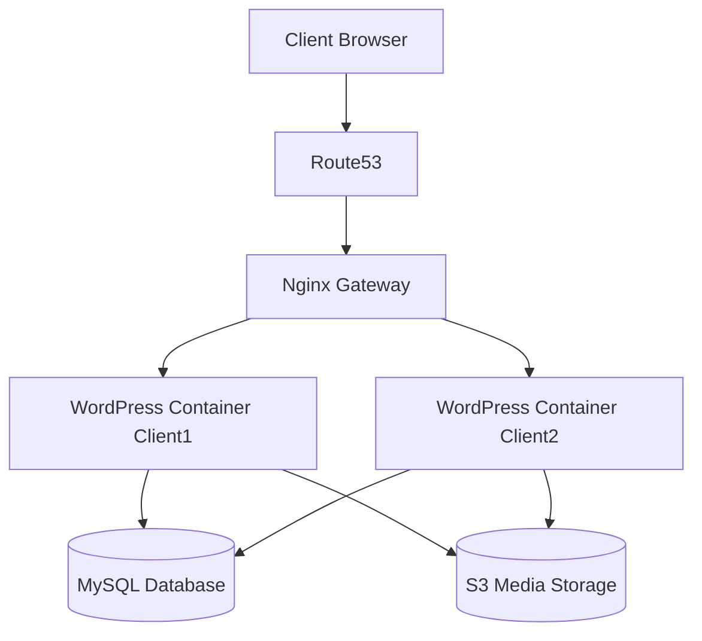

<div align="center">

# Multi-Client WordPress Hosting Platform

### Production-grade multi-tenant WordPress hosting on AWS
### The same architecture used by WP Engine, Kinsta, and Cloudways — built from scratch

[](https://aws.amazon.com/ecs/)
[](https://terraform.io)
[](https://github.com/features/actions)
[](LICENSE)

**Live platform:** `client1.babu-lahade.online` · `client2.babu-lahade.online` · `client3.babu-lahade.online`

</div>

---

## The Problem This Solves

Traditional shared hosting (cPanel, Hostinger) puts all clients on one server.  
**If Client A gets a traffic spike → Client B's site slows down.**  
**If Client A's database corrupts → Client B is at risk.**

This platform solves the multi-tenancy isolation problem:  
**Client A's spike, crash, or security issue cannot affect any other client — guaranteed and validated.**

---

## Architecture

```
Internet
    │
    ▼
Route53 (DNS — A record per client domain)
    │
    ▼
CloudFront (SSL termination · Static asset cache · ACM wildcard cert)
    │
    ▼
Application Load Balancer (Host-based routing)
    │
    ├── Host: client1.babu-lahade.online ──► Target Group 1
    ├── Host: client2.babu-lahade.online ──► Target Group 2
    ├── Host: client3.babu-lahade.online ──► Target Group 3
    ├── Host: client4.babu-lahade.online ──► Target Group 4
    └── Host: client5.babu-lahade.online ──► Target Group 5
                                                    │
                              ┌─────────────────────┘
                              ▼
                    ECS Fargate Task (per client · private subnet)
                    ┌─────────────────────────────────┐
                    │                                 │
                    │  ┌─────────────┐                │
                    │  │nginx:alpine │ ← port 80      │
                    │  │ /health→200 │                │
                    │  │fastcgi_pass │                │
                    │  └──────┬──────┘                │
                    │         │ FastCGI               │
                    │         ▼ localhost:9000         │
                    │  ┌─────────────┐                │
                    │  │wordpress:fpm│                │
                    │  │  port 9000  │                │
                    │  └──────┬──────┘                │
                    │         │                       │
                    └─────────┼───────────────────────┘
                              │
              ┌───────────────┼────────────────┐
              ▼               ▼                ▼
         RDS MySQL          EFS            Secrets
         (wp_clientN)  (wp-content)       Manager
         private subnet  per-client AP   (DB password)
```

**VPC Layout:**
```
10.0.0.0/16
├── Public Subnets    (10.0.1.0/24, 10.0.2.0/24)   — ALB + NAT Gateway
├── Private Subnets   (10.0.10.0/24, 10.0.11.0/24) — ECS Tasks
└── DB Subnets        (10.0.20.0/24, 10.0.21.0/24) — RDS MySQL
```

---

## Client Isolation — 4 Layers

| Layer | Isolation Method | Result |
|---|---|---|
| **Compute** | Separate ECS Fargate task per client | Client A crash cannot affect Client B |
| **Database** | Separate MySQL database per client (`wp_clientN`) | No cross-client data access possible |
| **Storage** | EFS access point per client (`/clientN/wp-content`) | Uploads and plugins fully isolated |
| **Logs** | Separate CloudWatch log group per client | Per-client debugging, no log mixing |

---

## Tech Stack

| Category | Technology | Why |
|---|---|---|
| **Compute** | ECS Fargate | Serverless containers — no EC2 management, native ALB + IAM integration |
| **Container** | wordpress:fpm + nginx:alpine | fpm on port 9000 (FastCGI) — no port conflict in awsvpc network mode |
| **IaC** | Terraform modules + `for_each` | New client = one variable change + `terraform apply` |
| **Load Balancer** | ALB host-based routing | One ALB, unlimited client domains via Host header rules |
| **Database** | RDS MySQL Multi-AZ | Managed, automatic failover, per-client database |
| **Storage** | EFS + per-client access points | wp-content persists across ECS task restarts |
| **Secrets** | AWS Secrets Manager | DB password injected at runtime — never hardcoded |
| **CI/CD** | GitHub Actions | Canary deploy → HTTP verify → global rollout |
| **Security** | OIDC federation | No static AWS keys — GitHub role assumed via token |
| **Scanning** | Trivy | CRITICAL CVEs block deployment before any push to ECR |
| **Monitoring** | CloudWatch Container Insights | Per-client CPU, memory, task count, request rate |
| **Alerting** | CloudWatch Alarms + SNS | Symptom-based alerts (5xx rate, task stopped, RDS connections) |
| **Dashboards** | Grafana | Per-client panels with deployment annotations |
| **DNS** | Route53 | A record per client domain → CloudFront |
| **CDN** | CloudFront + ACM | SSL termination, static asset caching, wildcard cert |

---

## CI/CD Pipeline — Canary Deployment Strategy

```
Push to main
      │
      ▼
┌─────────────────────────────────┐
│  BUILD + SCAN                   │
│  • docker build                 │
│  • Trivy scan (CRITICAL = fail) │
│  • Push to ECR (tagged: SHA)    │
└─────────────┬───────────────────┘
              │
              ▼
┌─────────────────────────────────┐
│  CANARY DEPLOY                  │
│  • Deploy to client3 only       │
│  • aws ecs wait services-stable │
│  • curl → check HTTP status     │
│    200? → continue              │
│    ≠200? → exit 1, HALT         │
└─────────────┬───────────────────┘
              │ HTTP 200 confirmed
              ▼
┌─────────────────────────────────┐
│  GLOBAL ROLLOUT                 │
│  • Deploy client4, client5      │
│  • Other clients protected      │
└─────────────────────────────────┘
```

**Key design decisions:**
- Images tagged with `$GITHUB_SHA` — every running task maps to an exact git commit
- OIDC federation — no static AWS access keys exist anywhere
- `aws ecs wait services-stable` — blocks until new task passes ALB health checks
- HTTP verification on live domain — not just "ECS says stable" but real end-to-end check
- `exit 1` on failure — GitHub Actions stops pipeline, client4/client5 untouched
- ECS circuit breaker with `rollback = true` — auto-reverts to previous task definition on failure

---

## Monitoring and Observability

### Alerting — Symptoms, Not Causes

| Alert | Threshold | Tier |
|---|---|---|
| ALB 5xx error rate | > 1% for 5 min | 🔴 Page immediately |
| ECS task count = 0 | Any service | 🔴 Page immediately |
| ECS CPU | > 75% sustained | 🟡 Warning |
| RDS connections | > 70% of max | 🟡 Warning |
| EFS burst credit | < 20% remaining | 🟡 Warning |

### Per-Client Grafana Dashboard

Each client has its own dashboard row:
- Request rate (req/sec)
- Error rate (%)
- P95 response time (ms)  
- ECS task count (shows auto-scaling events)
- RDS active connections

Deployment events shown as annotations — every spike correlates to a deploy.

### Structured Nginx Logs

```json
{
  "time": "2026-04-10T14:32:01Z",
  "client_id": "client1",
  "method": "GET",
  "uri": "/wp-admin/",
  "status": 200,
  "response_time": 0.243,
  "upstream_time": "0.241"
}
```

Query per-client errors in CloudWatch Logs Insights:
```sql
fields @timestamp, uri, status, response_time
| filter client_id = "client1" and status >= 500
| sort response_time desc
| limit 20
```

---

## Infrastructure as Code — Terraform Module Design

```
infrastructure/terraform/
├── main.tf                    # Root — calls all modules
├── variables.tf
├── outputs.tf
├── terraform.tfvars           # Client list — gitignored
└── modules/
    ├── vpc/                   # VPC, subnets, IGW, NAT, route tables
    ├── security_groups/       # ALB SG, App SG, RDS SG, EFS SG
    ├── alb/                   # ALB, target groups, listener rules per client
    ├── rds/                   # RDS MySQL, subnet group, parameter group
    ├── ecs/                   # Cluster, task definitions, services, autoscaling
    ├── efs/                   # EFS filesystem, mount targets, access points
    ├── secrets/               # Secrets Manager, rotation config
    ├── cloudfront/            # Distribution, cache behaviors, ACM cert
    ├── route53/               # A records per client
    └── monitoring/            # CloudWatch alarms, SNS, Grafana
```

**Adding a new client — one change:**
```hcl
# terraform.tfvars
ecs_clients = ["client1", "client2", "client3", "client4", "client5", "client6"]
#                                                                        ^^^^^^^^
#                                                                        add this
```

`terraform apply` creates: ECS task definition, ECS service, target group, ALB listener rule,
CloudWatch log groups, EFS access point, Grafana dashboard row. Automatically.

---

## Real Problems Debugged During Build

These are real failures hit during development — not from tutorials:

**1. ECS containers in restart loop**
Both `wordpress:latest` and `nginx` tried to use port 80 in `awsvpc` network mode (shared network namespace). Port conflict caused immediate container crash.
**Fix:** Switched to `wordpress:fpm` (PHP-FPM on port 9000, FastCGI protocol). nginx connects via `fastcgi_pass 127.0.0.1:9000` — not `proxy_pass` which is HTTP only.

**2. ALB health check loop causing task kills**
ALB health check hitting `/` during WordPress DB initialization returned 400. ALB marked target unhealthy → ECS killed task → restart → same cycle.
**Fix:** nginx `/health` endpoint returns 200 independently of WordPress state. ALB health check path changed to `/health`. Grace period set to 120s.

**3. WordPress "Error establishing database connection"**
`WORDPRESS_DB_HOST` was set to `aws_db_instance.wordpress.endpoint` which outputs `hostname:3306`. WordPress adds port internally — double port caused connection failure.
**Fix:** Changed to `aws_db_instance.wordpress.address` (hostname only). Critical distinction documented in Terraform module.

**4. nginx 502 on PHP requests**
nginx `proxy_pass` used for PHP routing. `wordpress:fpm` speaks FastCGI protocol, not HTTP. `proxy_pass` expects HTTP — protocol mismatch causes 502.
**Fix:** Changed to `fastcgi_pass` with `include fastcgi_params` and `SCRIPT_FILENAME` parameter.

**5. EFS mount causing task startup failure**
EFS mount target didn't exist in the same AZ as the ECS task subnet. NFS connection timed out at task start.
**Fix:** Created EFS mount target in every private subnet. Added `depends_on = [aws_efs_mount_target.wordpress]` to task definition.

---

## Auto-Scaling — Per-Client Isolation Proof

Each client scales independently. Client1 spike does not trigger Client2 scaling.

```
Scaling policies per client:
• CPU > 60% sustained    → scale out
• ALB requests > 1000/task → scale out  
• Min: 1 task · Max: 4 tasks
• Scale-out cooldown: 60s
• Scale-in cooldown: 300s
```

---

## Project Phases

| Phase | What Was Built | Status |
|---|---|---|
| **P0** | VPC, networking, Terraform remote state, security groups | ✅ Complete |
| **P1** | EC2 + docker-compose (learning phase — understand the stack) | ✅ Complete |
| **P2** | EKS — managed Kubernetes, ingress controller, HPA | ✅ Complete |
| **P3** | ECS Fargate — final production compute, EFS, Secrets Manager | ✅ Complete |
| **P4** | RDS Multi-AZ, S3 media offload, ElastiCache Redis | ✅ Complete |
| **P5** | HTTPS, CloudFront CDN, Route53, ACM wildcard cert | ✅ Complete |
| **P6** | GitHub Actions CI/CD — Trivy scan, ECR, canary deployment | ✅ Complete |
| **P7** | CloudWatch monitoring, Grafana dashboards, SNS alerting | ✅ Complete |
| **P8** | k6 load testing — isolation proof, auto-scaling proof | 🔨 In Progress |

---

## Security Practices

- **No static AWS keys** — GitHub Actions uses OIDC role federation, scoped to this repo + main branch only
- **No hardcoded secrets** — DB password stored in Secrets Manager, injected at ECS task start
- **Image scanning** — Trivy blocks deployment on any CRITICAL CVE before ECR push
- **Network isolation** — ECS tasks in private subnets, RDS in isolated DB subnets, no public IPs
- **Security group chaining** — RDS accepts port 3306 from ECS SG ID only (not VPC CIDR)
- **EFS encryption** — transit encryption enabled on all EFS mounts
- **ALB HTTPS** — HTTP redirects to HTTPS, ACM cert on both ALB and CloudFront

---

## Folder Structure

```
.
├── .github/workflows/         # CI/CD pipeline (build, scan, canary deploy)
├── docker/                    # Dockerfile, nginx config
├── infrastructure/terraform/  # All IaC — modules per AWS service
├── docs/
│   ├── architecture.md        # Detailed architecture decisions
│   ├── failures.md            # Real debugging log
│   ├── runbook.md             # Operational runbook
│   └── scaling.md             # Auto-scaling design
├── docker-compose.yml         # Local development only
└── README.md
```

---

## Author

**Babu Lahade**  
MCA — Cloud Computing · Savitribai Phule Pune University · 2026  
[LinkedIn](https://linkedin.com/in/babu-lahade-656034223) · [GitHub](https://github.com/BabuLahade)

> *Built to understand how production multi-tenant hosting actually works —  
> not by following a tutorial, but by hitting real failures and fixing them.*


# Multi-Client WordPress Hosting Platform

A DevOps platform that automatically provisions and manages multiple isolated WordPress websites for different clients using AWS infrastructure and containerized services.

The system demonstrates real-world platform engineering concepts:

- multi-tenant hosting
- automated provisioning
- infrastructure as code
- reverse proxy routing
- monitoring and failure handling

---

## Architecture Overview



Detailed architecture explanation is available in:

docs/architecture.md

---

## Key Features

- automatic provisioning of WordPress sites
- domain routing using Nginx reverse proxy
- container isolation between clients
- infrastructure managed using Terraform
- monitoring with Prometheus and Grafana
- failure analysis documentation

---

## Technology Stack

- AWS EC2
- Docker
- Nginx
- Terraform
- MySQL
- Prometheus
- Grafana

Technology decisions explained in:

docs/tech-decisions.md

---

## Project Structure

```bash
wordpress-platform/
│
├── infrastructure
├── provisioning-service
├── nginx-gateway
├── wordpress-template
├── monitoring
└── docs
```

---

## Request Flow

1. user visits a client domain
2. DNS resolves domain using Route53
3. request reaches Nginx gateway
4. Nginx routes request to correct WordPress container
5. WordPress retrieves data from database
6. response returned to user

---

## Running the Platform Locally

Clone the repository

```bash
git clone https://github.com/username/wordpress-platform
cd wordpress-platform
```

Start containers

```bash
docker-compose up -d
```

Verify running containers

```bash
docker ps
```

---

## Operational Documentation

Additional system documentation is available:

- docs/architecture.md
- docs/deployment.md
- docs/failures.md
- docs/scaling.md
- docs/runbook.md

These documents describe system design, operational failures, scaling strategies, and incident handling.

---

## Purpose of the Project

This project simulates a simplified version of a multi-tenant hosting platform similar to managed WordPress hosting providers.  

The focus is demonstrating:

- system design
- infrastructure automation
- operational reliability
- platform engineering concepts