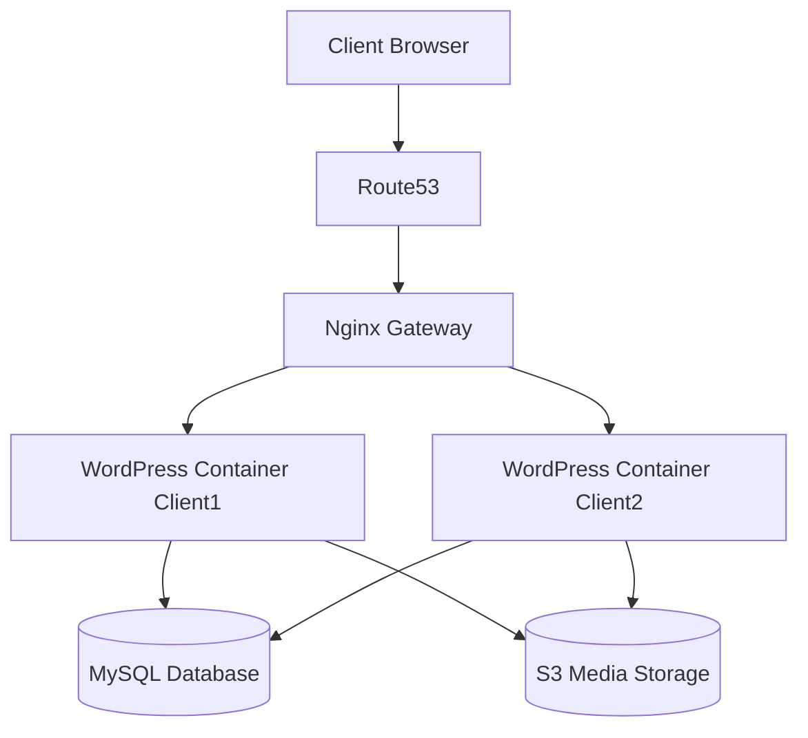

# Multi-Client WordPress Hosting Platform

A DevOps platform that automatically provisions and manages multiple isolated WordPress websites for different clients using AWS infrastructure and containerized services.

The system demonstrates real-world platform engineering concepts:

- multi-tenant hosting
- automated provisioning
- infrastructure as code
- reverse proxy routing
- monitoring and failure handling

---

## Architecture Overview



Detailed architecture explanation is available in:

docs/architecture.md

---

## Key Features

- automatic provisioning of WordPress sites
- domain routing using Nginx reverse proxy
- container isolation between clients
- infrastructure managed using Terraform
- monitoring with Prometheus and Grafana
- failure analysis documentation

---

## Technology Stack

- AWS EC2
- Docker
- Nginx
- Terraform
- MySQL
- Prometheus
- Grafana

Technology decisions explained in:

docs/tech-decisions.md

---

## Project Structure

```bash
wordpress-platform/
│
├── infrastructure
├── provisioning-service
├── nginx-gateway
├── wordpress-template
├── monitoring
└── docs
```

---

## Request Flow

1. user visits a client domain
2. DNS resolves domain using Route53
3. request reaches Nginx gateway
4. Nginx routes request to correct WordPress container
5. WordPress retrieves data from database
6. response returned to user

---

## Running the Platform Locally

Clone the repository

```bash
git clone https://github.com/username/wordpress-platform
cd wordpress-platform
```

Start containers

```bash
docker-compose up -d
```

Verify running containers

```bash
docker ps
```

---

## Operational Documentation

Additional system documentation is available:

- docs/architecture.md
- docs/deployment.md
- docs/failures.md
- docs/scaling.md
- docs/runbook.md

These documents describe system design, operational failures, scaling strategies, and incident handling.

---

## Purpose of the Project

This project simulates a simplified version of a multi-tenant hosting platform similar to managed WordPress hosting providers.  

The focus is demonstrating:

- system design
- infrastructure automation
- operational reliability
- platform engineering concepts