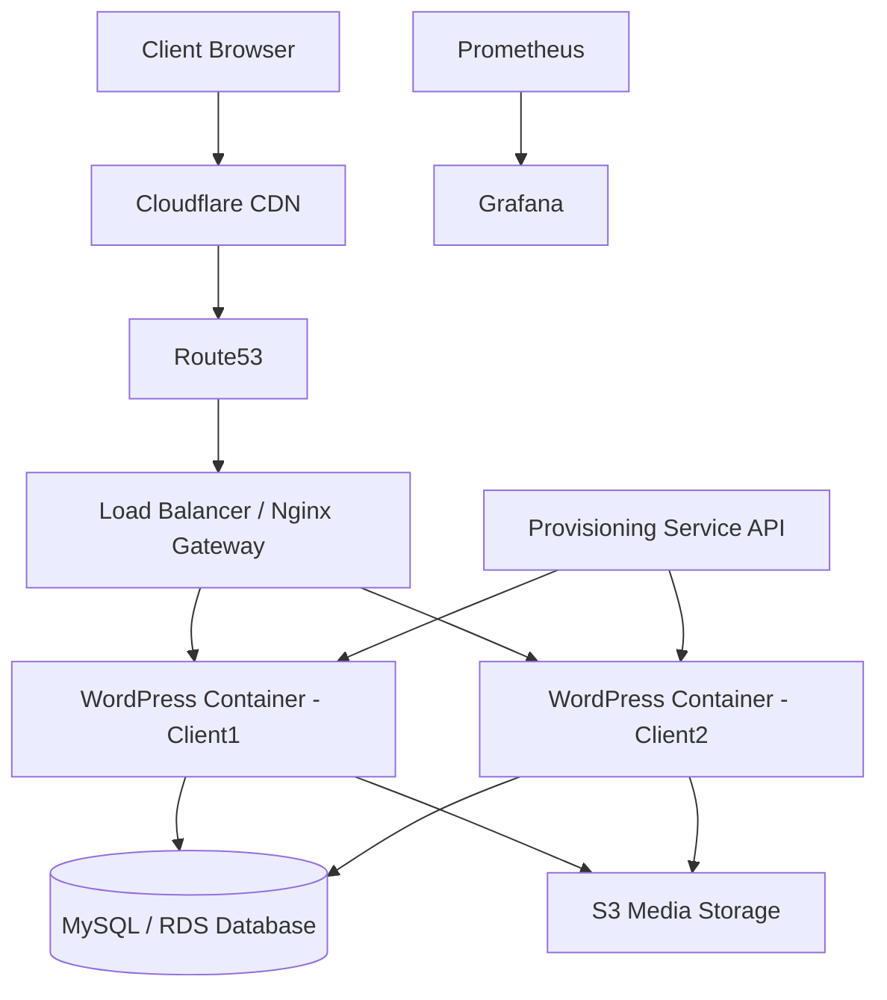

## ARCHITECTURE 
 - system overview
      - network layout
      - services used
      - client onboarding flow
      - failure handling strategy
---
 ## System 
 ```
System :
   
   Route 53
      |
   Cloudfront CDN 
      |
     WAF
      |
  Application Load Balancer
      |
  Wordpress Containers (Docker/Kubernetes)
      |
  Redis Cache  
      |
   RDS MySQL 
      |
   s3 storage   
   ```
   ---

   # Architecture

## Overview

This platform hosts multiple WordPress sites using containerized infrastructure.

---

## Components

     - Nginx Gateway
- WordPress Containers
- MySQL Database
- Monitoring Stack

---

## Request Flow

1. User visits website
2. Nginx receives request
3. Nginx routes request to correct container
4. WordPress serves content

---

## Example Command

```bash
docker ps
```
