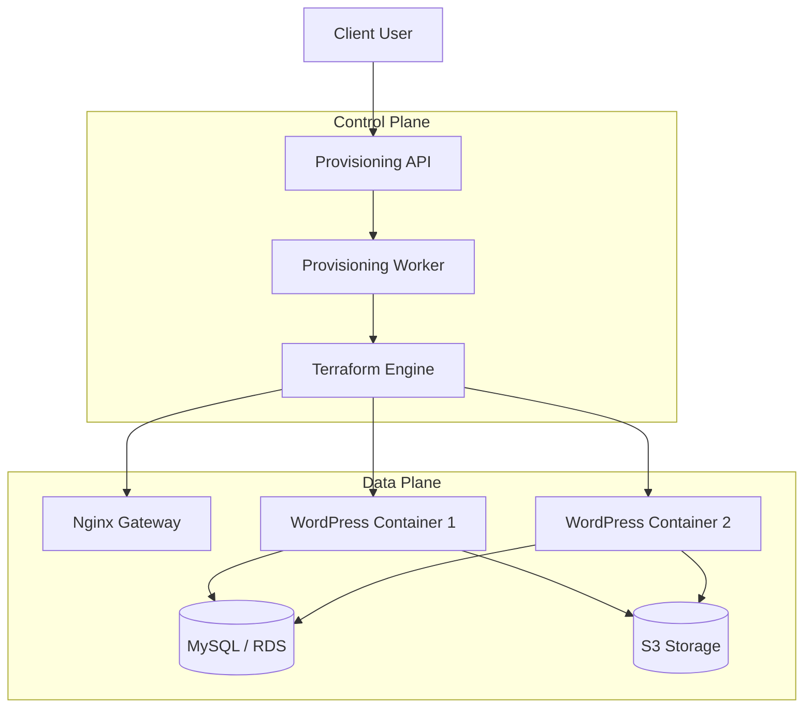

## Platform Architecture

```mermaid
flowchart TD

User[Client User]

subgraph Control Plane
API[Provisioning API]
Worker[Provisioning Worker]
IaC[Terraform Engine]
end

subgraph Data Plane
Nginx[Nginx Gateway]
WP1[WordPress Container 1]
WP2[WordPress Container 2]
DB[(MySQL / RDS)]
S3[(S3 Storage)]
end

User --> API
API --> Worker
Worker --> IaC

IaC --> Nginx
IaC --> WP1
IaC --> WP2

WP1 --> DB
WP2 --> DB

WP1 --> S3
WP2 --> S3
```